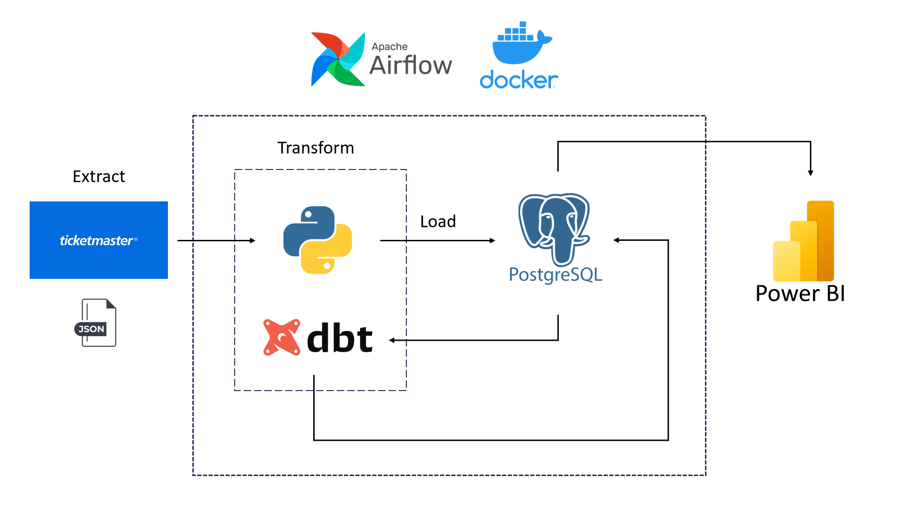
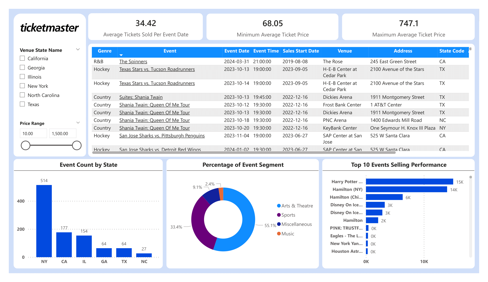

# Ticketmaster Event Pipeline

## Description
A starter data pipeline project with Python, dbt, Docker, Airflow, and Postgres! 

This project is used to demonstrate my understading on ETL frameworks and how to design a simple data flow by using Ticketmaster API to extract events data from Ticketmaster with Python. Data is then transformed with Python and dbt before being loaded into Postgres database orchestrated by Airflow. Finally, PowerBI is used for visualizing event information.

## Dataset

[Ticketmaster API](https://developer.ticketmaster.com/) was used to fetch raw data of events (e.g., concerts, sport events, etc) around the world. Working with this dataset has also helped me familiarize with API use as well!

## Techstack

- Transformation - [**Python**](https://www.python.org/), [**dbt**](https://www.getdbt.com)
- Data Warehouse - [**PostgreSQL**](https://www.postgresql.org/)
- Data Visualization - [**PowerBI**](https://powerbi.microsoft.com/en-us/)
- Orchestration - [**Airflow**](https://airflow.apache.org)
- Containerization - [**Docker**](https://www.docker.com), [**Docker Compose**](https://docs.docker.com/compose/)

## Architecture

## Visualization

## Credits
Thank you [DataTalks Club](https://datatalks.club) for offering this free [course](https://github.com/DataTalksClub/data-engineering-zoomcamp) that helps me learn about the forementioned tools, especially Docker. I would also like to thank my colleagues for sharing their knowledge and learning with me!
